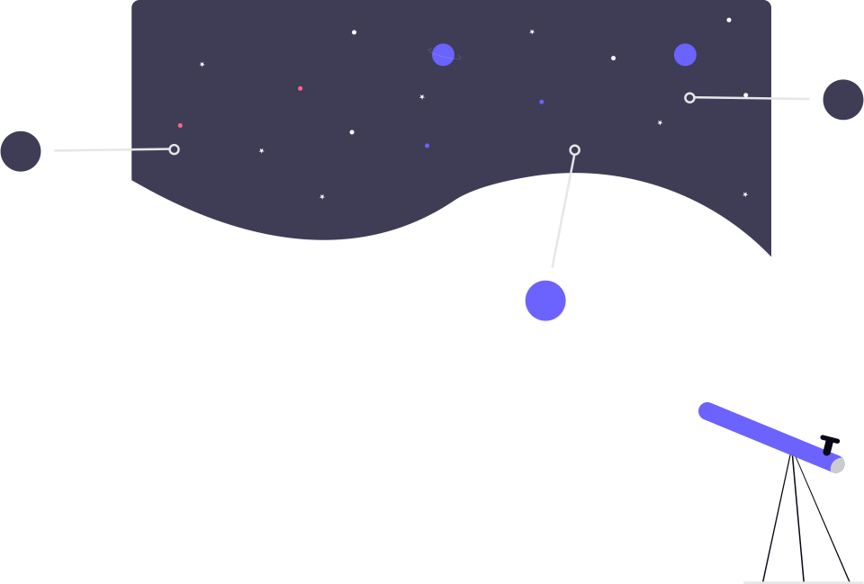
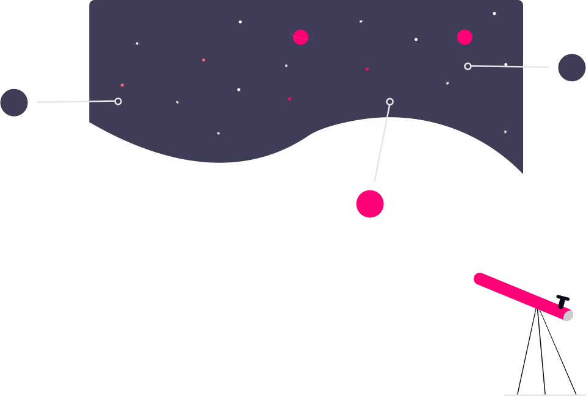

# unDraw CLI 🎭

[](https://www.npmjs.com/package/undraw-cli)
[](https://opensource.org/licenses/MIT)
[](https://github.com/stefdevscore/undraw-cli/blob/main/CONTRIBUTING.md)

> A high-performance, ultra-minimalist CLI to search, customize, and download the entire [unDraw](https://undraw.co) library (1,650+ illustrations) for your next project.

---

## ✨ Features

- **🎯 Zero-Dependency Networking**: Built with native Node 20 `fetch`—no external network libraries.
- **🚀 Consolidated Search**: Search 1,650+ illustrations by keyword or browse by page using a single unified command.
- **🎨 On-the-Fly Customization**: Automatically replace the default unDraw color with your brand's hex code.
- **📦 Ultra-Tiny footprint**: Only **40 kB** unpacked. Reached "4-file parity" with premium standards.
- **🤖 Agentic Ready**: Optimized for AI developers who need structured, fast access to high-quality SVG assets.

---

## 🎨 Zero-Config Customization

One command to match your brand. No browser required.

| Original (`#6c63ff`) | Customized (`#ff0077`) |
| :--- | :--- |
|  |  |

```bash
undraw download astronomy_ied1 --color #ff0077
```

---

## 🚀 Quick Start

### Installation

```bash
npm install -g undraw-cli
```

### Usage

1. **List or Search illustrations**:
   ```bash
   undraw list           # Browse by page (20 per page)
   undraw list "space"   # Search for "space"
   undraw list --page 2  # Go to page 2
   ```

2. **Download with a custom color**:
   ```bash
   undraw download astronomy_ied1 --color #34d399
   ```

3. **Sync the library** (updates the embedded inventory):
   ```bash
   undraw sync
   ```

---

## 🛠️ Commands

- `undraw list [query]`: Paginated browsing or keyword search.
- `undraw download <id>`: Fetch the SVG and apply a custom hex color.
- `undraw sync`: Crawls unDraw.co and updates the embedded source metadata.

---

## 🗺️ Roadmap
Check out our [Roadmap](./docs/roadmap.md) for planned features like Interactive TUI, Global Mirroring, and ANSI Previews.

---

## 🙏 Credits & Attribution

### unDraw Illustrations
The illustrations are provided by the amazing **Katerina Limpitsouni** at [unDraw.co](https://undraw.co).  
If you love these illustrations, please visit their website and support their work!

*Note: This is an unofficial community project and is not affiliated with unDraw.co.*

---

## ⚖️ License
MIT © [azk](https://github.com/stefdevscore)
